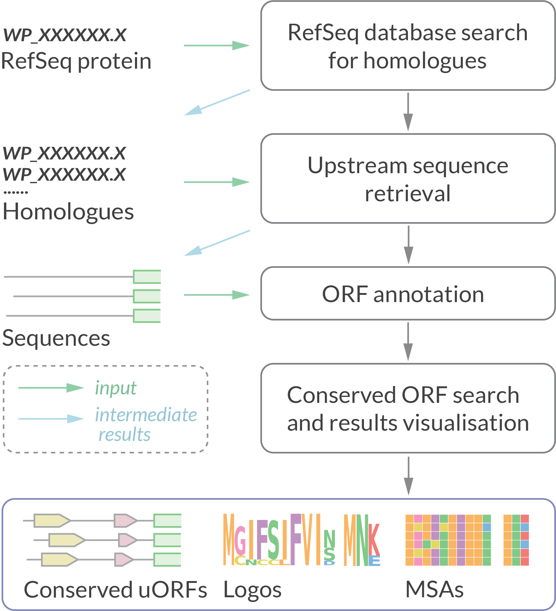

## Description

**uORF4u** is a bioinformatics tool for conserved upstream ORF annotation.   

**Programming language:** Python3   
**OS:** MacOS, Linux  
**Python dependencies:** biopython, configs, argparse, pandas, statistics, logomaker, matplotlib, reportlab.  
**Python version:** >= 3.7  
**OS-level dependencies:** mafft (v7.490 is included in the package)  
**License:** CC0  
**Version:** 0.9.5 (May 2023)

**Web version is available at the Atkinson Lab Server Portal: [server.atkinson-lab.com/uorf4u](https://server.atkinson-lab.com)**

### [**Detailed documentation**](https://GCA-VH-lab.github.io/uorf4u)

### Data analysis pipeline: 



## Installation 🛠️

- The most stable release of uorf4u can be installed directly from pypi:

```
python3 -m pip install uorf4u
```

- The development version is available at github :

```
git clone https://github.com/GCA-VH-lab/uorf4u.git
cd uorf4u
python3 -m pip install --upgrade pip
python3 -m pip install wheel
python3 setup.py sdist bdist_wheel
python3 -m pip install -e .
```

**!** If you're a linux user, run `uorf4u --linux` post-install command once to update paths in the premade config files that set by default for MacOS users.


## Reference 📃

If you find uorf4u useful, please cite:  
Artyom. A. Egorov, Gemma C. Atkinson, **uORF4u: a tool for annotation of conserved upstream open reading frames**, *Bioinformatics, Volume 39, Issue 5, May 2023, btad323; doi: [10.1093/bioinformatics/btad323](https://doi.org/10.1093/bioinformatics/btad323)*

## Contact 📇

Please contact us by e-mail _artem**dot**egorov**AT**med**dot**lu**dot**se_ or use [Issues](https://github.com/GCA-VH-lab/uorf4u/issues?q=) to report any technical problems.  
You can also use [Discussions section](https://github.com/GCA-VH-lab/uorf4u/discussions) for sharing your ideas or feature requests! 

## Authors 👨🏻‍💻

uORF4u is developed by Artyom Egorov at [the Atkinson Lab](https://atkinson-lab.com), Department of Experimental Medical Science, Lund University, Sweden 🇸🇪. We are open for suggestions to extend and improve svist4get functionality. Please don't hesitate to share your ideas or feature requests.
