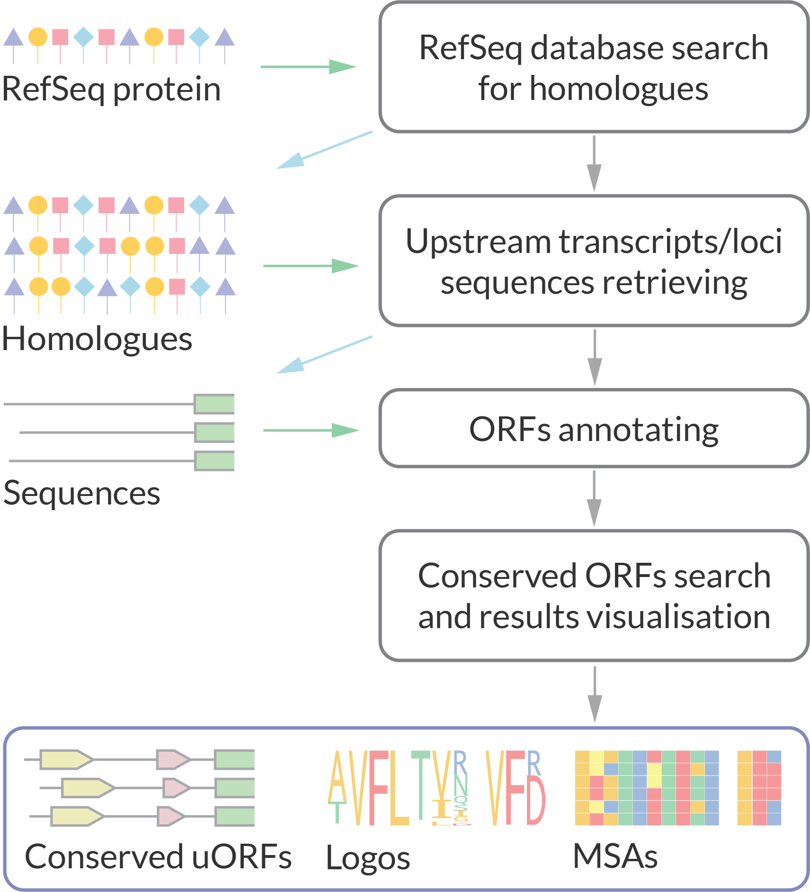

## Description

uorf4u is a bioinformatics tool for conserved upstream ORFs annotation.    

**Programming languages:** Python3   
**OS:** MacOS, Linux  
**Python dependencies:** biopython, configs, argparse, pandas, statistics, logomaker, matplotlib, reportlab.  
**R dependencies:** ggmsa, ggplot2, optparse  
**OS-level dependencies:** mafft (v. 7.505 is included in the package)   
**License:** [WTFPL](http://www.wtfpl.net)  
**Version:** 0.5.4 (October 2022)

[**Detailed documentation**](https://art-egorov.github.io/uorf4u)

### Data analysis pipeline:




## Installation

- The most stable release of uorf4u can be installed directly from pypi:

```
python3 -m pip install uorf4u
```

- The development version is available at github :

```
git clone https://github.com/art-egorov/uorf4u.git
cd uorf4u
python3 -m pip install --upgrade pip
python3 -m pip install wheel
python3 setup.py sdist bdist_wheel
python3 -m pip install -e .
```

**!** If you're a linux user, run `uorf4u --linux` post-install command once to update paths in the premade config files that set by default for MacOS users.


## Reference

If you find uorf4u useful, please cite:  
Artyom A. Egorov, Gemma C. Atkinson **uorf4u: ...,** *---, [doi]()*


## Contact

Please contact us by e-mail _artem**dot**egorov**AT**med**dot**lu**dot**se_ or use Issues to report any technical problems.  


## Authors

uorf4u is developed by Artyom Egorov at [The Atkinson Lab](https://atkinson-lab.com), Department of Experimental Medical Science, Lund University, Sweden. We are open for suggestions to extend and improve uorf4u functionality. Please don't hesitate to share your ideas or feature requests.

